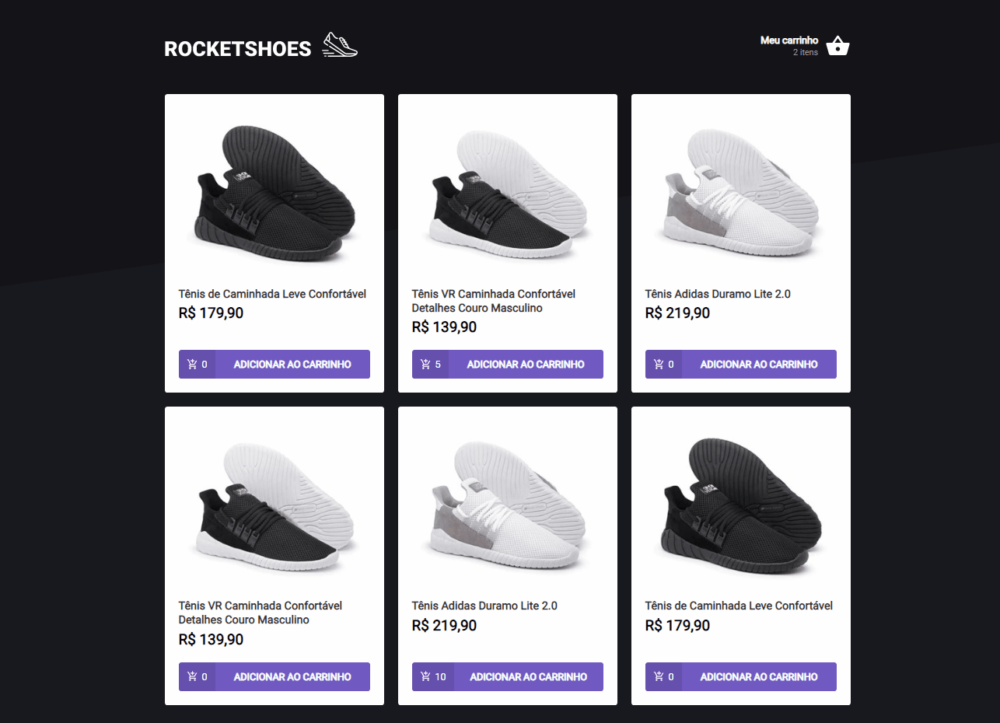

<h1 align="center">
  RocketShoes
</h1>

Esse desafio tem como objetivo criar um contexto para o gerenciamento de um carrinho de compras.

## 👀 Requisitos
- [x] Adicionar um novo produto ao carrinho;
- [x] Remover um produto do carrinho;
- [x] Alterar a quantidade de um produto no carrinho;
- [x] Cálculo dos preços sub-total e total do carrinho;
- [x] Validação de estoque;
- [x] Exibição de mensagens de erro.

## 💻 Aplicação

